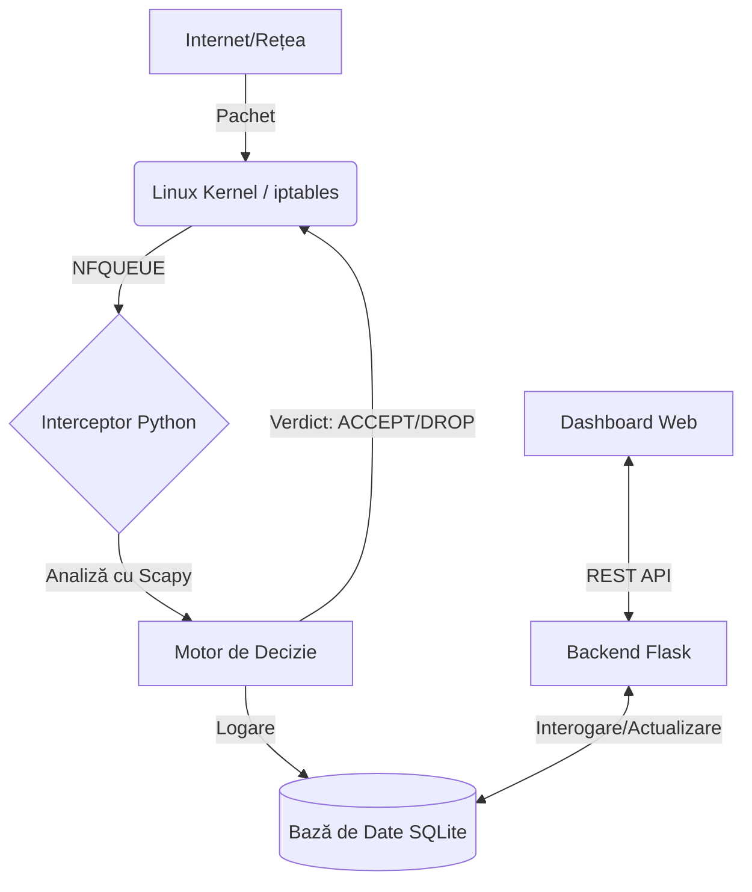

# Sistem de Management și Interceptare a Traficului de Rețea

Acest proiect reprezintă o lucrare de licență ce vizează dezvoltarea unui firewall software capabil să intercepteze pachete direct din Kernel-ul Linux, să le analizeze logic în Userspace folosind Python și să ofere o interfață web pentru administrare vizuală.

---

## Obiectiv Principal

Dezvoltarea unei soluții care depășește limitările firewall-urilor statice, oferind inspecție la nivel de aplicație (Deep Packet Inspection) și răspuns automatizat la amenințări în timp real.

---

## Arhitectură și Tehnologii

Sistemul este structurat pe patru niveluri fundamentale:

* **Nivelul Rețea (Kernel):** Bazat pe `Ubuntu Server` (cu potențial de portare pe OpenWrt/Raspberry Pi), utilizează mecanismele `iptables/nftables` și `NFQUEUE` pentru extragerea pachetelor din fluxul standard al sistemului.

* **Nivelul Logic (Core Engine):** Implementat în `Python 3`, utilizează librăria `Scapy` pentru analiza detaliată și `NetfilterQueue` pentru procesarea pachetelor și emiterea verdictului de tip `ACCEPT` sau `DROP`.

* **Nivelul Date:** Utilizarea `SQLite` pentru stocarea eficientă a log-urilor de trafic și a regulilor de filtrare.

* **Nivelul Interfață (Web UI):** Backend dezvoltat în `Flask` (REST API) și frontend realizat cu `HTML5`, `Bootstrap` și `Chart.js` pentru monitorizare grafică.

---

## Diagramă de Funcționare

---

## Elemente de Inovație și Proces de Gândire

### Inspecție Layer 7 Lite (Deep Packet Inspection)

**Concept:** Filtrare pe baza conținutului (payload), nu doar IP/Port.

**Raționament:** Firewall-urile clasice analizează doar antetul (header). Proiectul vizează detectarea atacurilor mascate în porturi permise (ex. SQL Injection pe portul 80) prin scanarea activă a conținutului pachetului.

---

### Securitate Reactivă (IPS - Intrusion Prevention System)

**Concept:** Crearea automată de reguli în urma unui comportament suspect detectat.

**Raționament:** Automatizarea apărării pentru a contracara atacuri de tip Flood. La depășirea unui prag critic de pachete/secundă, sistemul blochează sursa fără intervenție umană.

---

### Mecanism Honeyport (Capcană)

**Concept:** Expunerea unor porturi false pentru identificarea timpurie a atacatorilor.

**Raționament:** Utilizatorii legitimi accesează doar serviciile reale. Orice tentativă asupra acestor porturi "momeală" indică un bot sau un scaner, permițând blocarea proactivă a IP-ului.

---

### Vizualizarea Real-Time a Amenințărilor

**Concept:** Transformarea jurnalelor de tip text în indicatori vizuali dinamici.

**Raționament:** Monitorizarea securității prin terminal este ineficientă în timpul unui atac masiv. Un dashboard permite identificarea instantanee a anomaliilor prin vârfuri de grafic.

---

## Mecanisme Firewall Implementate

* **Filtrarea pachetelor:** Gestionarea traficului pe baza protocolului, adresei IP și a portului (Layer 3/4).

* **Inspecția de stare (Stateful Inspection):** Monitorizarea conexiunilor pentru a distinge între cereri noi și sesiuni deja stabilite.

* **Management NAT / DNAT:** Facilitarea rutării traficului și a serviciilor de Port Forwarding către rețeaua internă.

* **Userspace Interception:** Preluarea granulară a controlului prin redirecționarea pachetelor către logica de aplicație via NFQUEUE.

---

## Mediu de Testare

Validarea sistemului a fost realizată într-un mediu virtualizat (VirtualBox) compus din:

* **VM 1 (Firewall):** Ubuntu Server - nucleul central al aplicației NetGuard.

* **VM 2 (Atacator):** Kali Linux - utilizat pentru simularea atacurilor (scanări cu Nmap, flood cu Hping3).

* **VM 3 (Client/Victimă):** Ubuntu Desktop - pentru generarea traficului legitim și verificarea conectivității.
